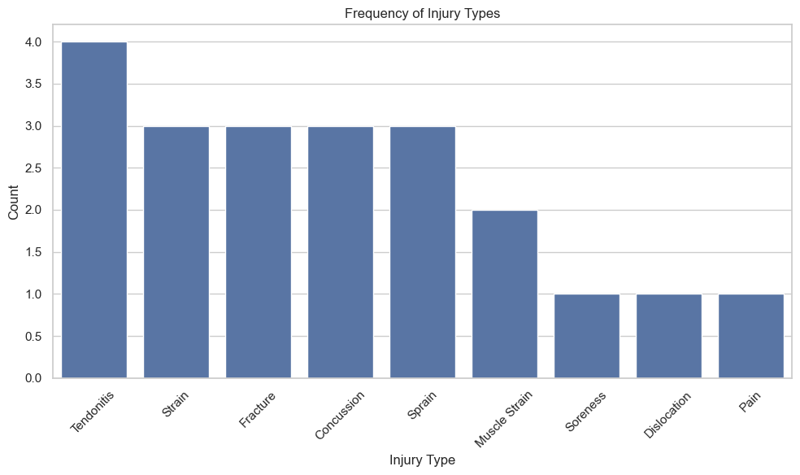
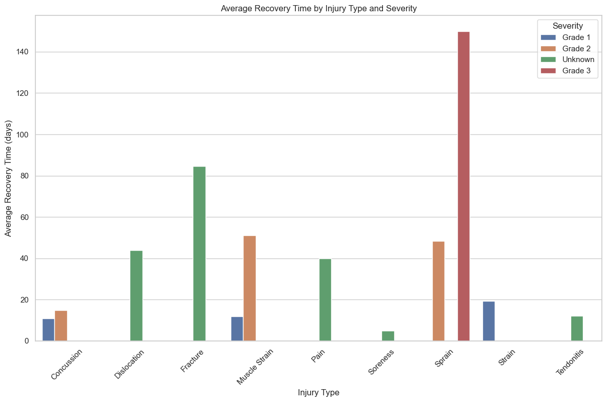
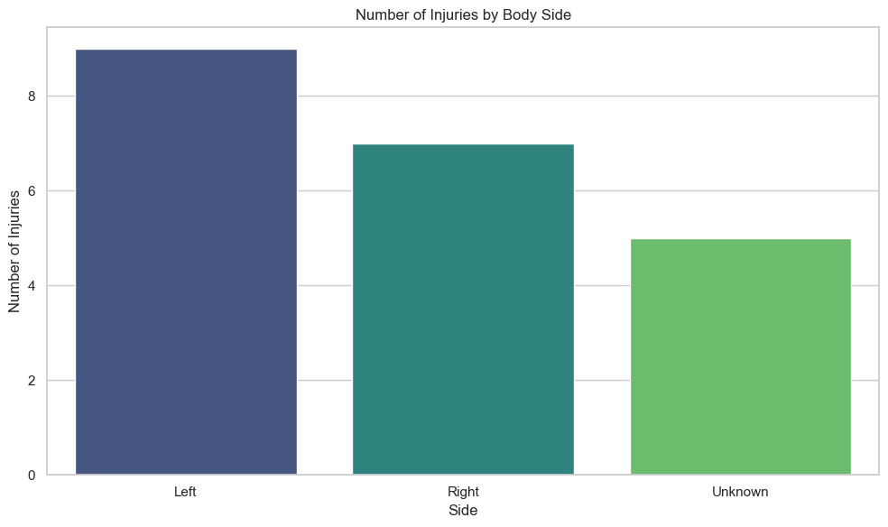
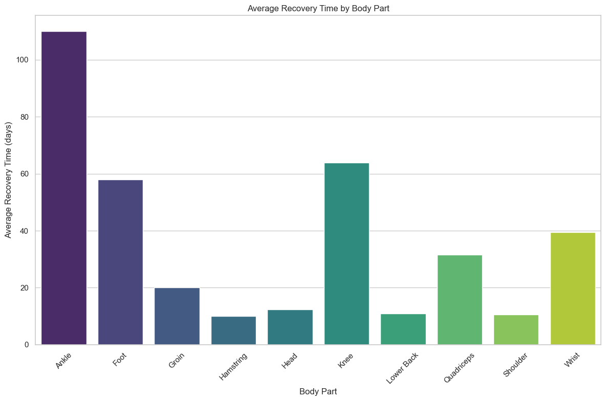
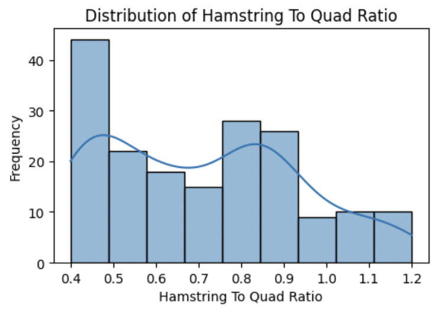
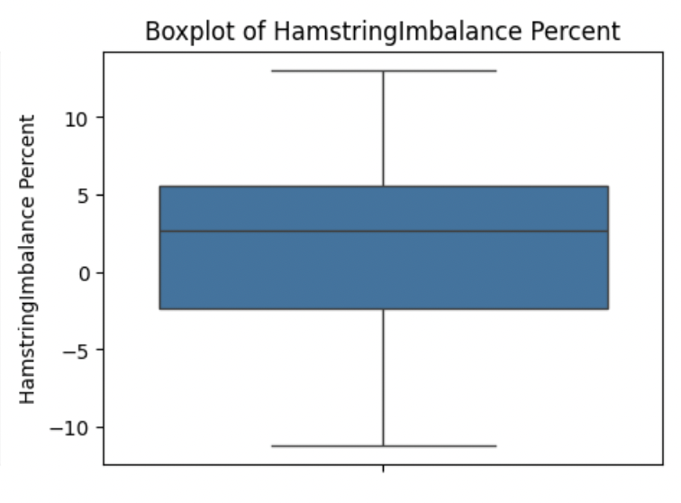
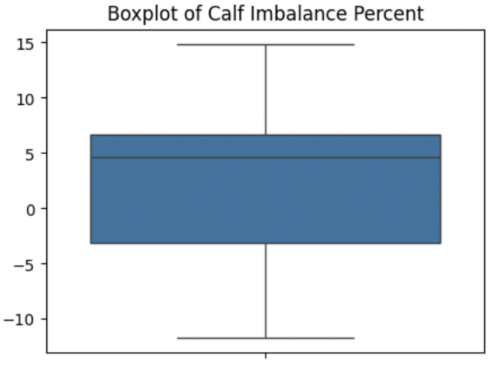
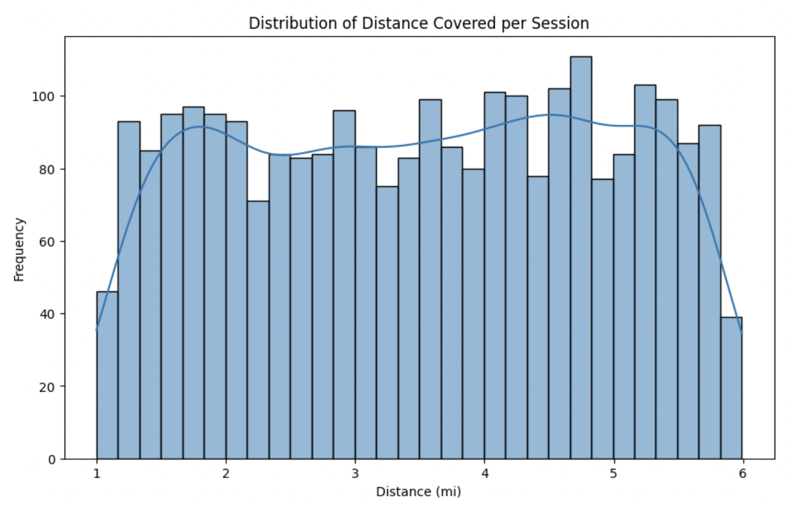

# Injury History Dataset: Comprehensive Analysis Summary

### Overview
This comprehensive analysis of the injury history dataset provides key insights into the occurrence, severity, recurrence, and recovery times of injuries experienced by players. The following summary highlights key findings and recommendations based on the exploratory data analysis conducted across various aspects of the dataset.

### Key Findings and Insights

1. **Injury Type Frequency and Body Parts Affected**
   - The most common injury types were **Tendonitis** and **Muscle Strain**, indicating a need for targeted prevention efforts for these specific types.
   - Injuries frequently affected the **Knee** and **Head**. Strengthening exercises should focus specifically on these areas to minimize the injury risk, as they are disproportionately affected.

   
   - **Visual Insight**: The bar chart shows that knee injuries are the most frequent, suggesting a focus on knee strengthening and protection strategies.

   
   - **Visual Insight**: The distribution of injuries by body part highlights the need for targeted interventions in areas like the knee and head.

2. **Recovery Time Analysis**
   - Recovery times varied significantly, ranging from 5 to 150 days, with most injuries recovering within 20 to 40 days. The longest recovery time was associated with an injury lasting 150 days.
   - Grade 2 injuries had an average recovery time of 40.8 days, which was notably longer compared to Grade 1 injuries that averaged 15.3 days. This suggests a need for more extensive rehabilitation protocols for severe injuries.

   
   - **Visual Insight**: The histogram indicates a concentration of recovery times around 20-40 days, with outliers extending to 150 days, emphasizing the variability in recovery needs.

   
   - **Visual Insight**: The plot shows that more severe injuries (Grade 2) require longer recovery, highlighting the importance of severity-specific rehabilitation plans.

3. **Severity and Group Analysis**
   - Group ID 215 had the highest number of Grade 2 injuries and also experienced Grade 1 and Grade 3 injuries.
   - The average recovery time for Group ID 215 was 71.7 days, which was notably higher compared to other groups, indicating the need for more tailored recovery programs.

   
   - **Visual Insight**: The bar chart reveals that Group ID 215 has a higher incidence of severe injuries, suggesting a review of their training and recovery protocols.

   
   - **Visual Insight**: The average recovery time plot indicates that Group ID 215 requires longer recovery periods, necessitating customized rehabilitation strategies.

4. **Seasonal Injury Trends**
   - Injuries were most common during Winter, followed by Fall and Summer. The fewest injuries occurred during Spring. This indicates that Winter is a particularly high-risk season, potentially due to factors such as colder weather affecting player conditioning and performance.
   - Preemptive measures, such as adjusting training loads and incorporating injury prevention exercises, should be prioritized during the Winter season to reduce injury occurrences.

   
   - **Visual Insight**: The seasonal trend graph shows a spike in injuries during Winter, suggesting the need for seasonal training adjustments.

5. **Player Injury Profiles and Recurrence**

   | Player ID | Injury Type | Count | Average Recovery Time (days) |
   |-----------|-------------|-------|-----------------------------|
   | 101       | Tendonitis  | 2     | 11.5                        |
   | 115       | Sprain      | 2     | 102.5                       |

   - **Player ID 101** experienced **Tendonitis** twice, with an average recovery time of 11.5 days, suggesting possible insufficient recovery or underlying vulnerability.
   - **Player ID 115** experienced **Sprain** twice, with an average recovery time of 102.5 days, indicating a severe recurring injury that requires specialized attention and longer rehabilitation to prevent further recurrence.

6. **Body Side Analysis**
   - Injuries were slightly more frequent on the left side compared to the right, while some injuries did not specify the side. This suggests a potential balance which might not be significant.

   
   - **Visual Insight**: The side analysis chart shows a slight imbalance in injury occurrence, which may warrant further investigation into training symmetry.

7. **Recovery Time by Body Part**
   - Ankle injuries had the longest average recovery time, followed by Knee and Foot injuries.
   - Focused rehabilitation programs should be developed for body parts such as Ankle, Knee, and Foot to shorten recovery times and enhance player readiness.

   
   - **Visual Insight**: The recovery time by body part chart highlights the need for targeted rehabilitation for ankle and knee injuries.

8. **Muscle Imbalance Analysis**

   Muscle imbalances can significantly impact an athlete's performance and increase the risk of injury. By analyzing the muscle imbalance data, we can identify areas that require targeted interventions to enhance player stability and reduce injury risk.

   - **Hamstring to Quad Ratio**: 
     - **Mean**: 0.71, which is within the ideal range of 0.6 to 0.8. This ratio is crucial for knee stability, as a balanced ratio helps prevent knee injuries by ensuring that the hamstrings and quadriceps are equally strong.
     - **Range**: 0.4 to 1.2. Values below 0.6 indicate hamstring weakness, which can lead to knee instability and potential injuries. Values above 0.8 suggest quad underuse, which might result in reduced explosive power and increased injury risk.

     
     - **Visual Insight**: The ratio chart confirms that most players maintain a healthy balance between hamstring and quad strength, with a few outliers that may require targeted strength training.

   - **Quad Imbalance Percent**:
     - **Mean**: 2.51%, within the ideal range of -5% to 5%. This metric indicates the balance between the left and right quadriceps. A balanced quad strength is essential for symmetrical movement and reducing the risk of side-dominant injuries.
     - **Range**: -11.5% to 15.2%. Values below -5% indicate a weaker left quad, while values above 5% suggest a stronger right quad, both of which can lead to imbalances in movement and increased injury risk.

     
     - **Visual Insight**: The imbalance chart shows that most players have balanced quadriceps, with few deviations that may require corrective exercises.

   - **Hamstring Imbalance Percent**:
     - **Mean**: 0.98%, within the ideal range of -5% to 5%. This metric reflects the balance between the left and right hamstrings, which is crucial for maintaining symmetrical leg strength and reducing injury risk.
     - **Range**: -11.2% to 13.0%. Values below -5% indicate a weaker left hamstring, while values above 5% suggest a stronger right hamstring, both of which can lead to asymmetrical movement patterns and potential injuries.

     
     - **Visual Insight**: The hamstring imbalance chart indicates a generally balanced muscle group, with minor deviations that may benefit from targeted strengthening exercises.

   - **Calf Imbalance Percent**:
     - **Mean**: 2.42%, within the ideal range of -5% to 5%. Balanced calf strength is important for stability during running and jumping activities.
     - **Range**: -11.7% to 14.9%. Values below -5% indicate a weaker left calf, while values above 5% suggest a stronger right calf, both of which can affect balance and increase the risk of lower leg injuries.

     
     - **Visual Insight**: The calf imbalance chart suggests a balanced muscle group, with few outliers that may require specific strengthening exercises.

   - **Groin Imbalance Percent**:
     - **Mean**: 2.44%, within the ideal range of -5% to 5%. Balanced groin strength is essential for lateral movements and reducing the risk of groin strains.
     - **Range**: -11.7% to 15.0%. Values below -5% indicate a weaker left groin, while values above 5% suggest a stronger right groin, both of which can lead to imbalances in lateral movements and potential injuries.

     
     - **Visual Insight**: The groin imbalance chart shows a balanced muscle group, with minimal deviations that may benefit from targeted exercises.

9. **Session Metrics**

   Session metrics provide valuable insights into the physical demands placed on players during training and games. By analyzing these metrics, we can optimize training programs to enhance performance and reduce injury risk.

   - **Mean Distance Covered in Miles**: 3.51
     - This metric indicates the average distance players cover during sessions, reflecting their endurance and workload. Consistent monitoring helps ensure that players maintain optimal fitness levels without overtraining.

     
     - **Visual Insight**: The distance covered chart indicates a consistent workload across sessions, essential for endurance training. Variations in distance may suggest changes in training intensity or player fatigue.

   - **Mean Exertion**: 297.30
     - Exertion measures the physical effort exerted by players, which is crucial for balancing training intensity and recovery. High exertion levels may indicate intense sessions that require adequate recovery to prevent fatigue-related injuries.

     
     - **Visual Insight**: The exertion distribution chart shows varying levels of effort, highlighting the need for balanced training intensity to prevent overtraining.

     
     - **Visual Insight**: The exertion over time chart suggests periods of high intensity, which may require strategic recovery planning to maintain player performance and reduce injury risk.

   - **Mean Training Impulse (TRIMP)**: 197.85
     - TRIMP is a composite score that reflects the overall training load by considering both the duration and intensity of exercise. It is a valuable metric for understanding the cumulative stress placed on players, aiding in the design of training programs that optimize performance while minimizing injury risk.

     
     - **Visual Insight**: The training impulse chart reflects the cumulative training load, crucial for managing player fatigue. Consistent TRIMP scores suggest a balanced training program, while spikes may indicate periods of increased intensity.

   - **Mean of Max Jump Height in Feet**: 2.55
     - Jump height is indicative of a player's explosive power and lower body strength. Regular monitoring can help identify potential improvements in athletic performance or detect declines that may signal fatigue or injury.

     
     - **Visual Insight**: The jump height chart indicates the explosive power of players, important for performance assessments. Variations in jump height may suggest changes in player conditioning or fatigue levels.

   - **Mean Heart Rate (bpm)**: 119.72
     - Heart rate is a critical indicator of cardiovascular fitness and exertion levels. By analyzing heart rate data, coaches can tailor training sessions to ensure they are within safe and effective intensity ranges for each player.

   These session metrics collectively provide a comprehensive overview of player performance and physical demands during training sessions. By analyzing these data points, coaches and sports scientists can make informed decisions to enhance player performance and reduce injury risks.

## Recommendations
- **Balance Training**: Focus on strengthening weak muscles identified outside the ideal range.
- **Injury Prevention**: Address asymmetries in hamstring-to-quad and side-to-side muscle balances to reduce injury risk.
- **Performance Improvement**: Achieving balance within the ideal range can enhance stability and performance.
- **Prevention Programs**: Focus on strengthening exercises for the Quadriceps, Wrist, and Groin, as these body parts are most frequently injured and have longer recovery times.
- **Seasonal Adjustments**: Implement seasonal training modifications during Spring and Fall, as these seasons see the highest number of injuries. Adjust training loads and include specific injury prevention exercises during these times.
- **Targeted Interventions for Recurrence**: Develop specialized rehabilitation for players prone to recurring injuries, such as Player ID 101 (Tendonitis) and Player ID 115 (Sprain), to ensure complete recovery and reduce future risks.
- **Group-Specific Recovery Strategies**: Review Group ID-specific training and rehabilitation practices, especially for Group ID 2, which had the highest number of severe injuries, and Group ID 3, which had longer average recovery times. Adjust training methodologies to improve conditioning and reduce injury severity.
- **Side-Specific Training**: Implement balanced strength training to address asymmetries between the left and right sides of the body, reducing the likelihood of side-dominant injuries, particularly focusing on the right side, which had a slightly higher injury count.
- **Detailed Data Collection**: Improve data collection by ensuring that injury attributes like side (Left/Right) are consistently recorded, enabling more detailed analysis and insights for future injury prevention strategies.

### Conclusion
This analysis provides a detailed understanding of injury patterns, severity, recurrence, and recovery times for players in the dataset. By focusing on the data-driven recommendations above, it is possible to reduce injury occurrences, improve recovery outcomes, and ultimately enhance player safety and performance.