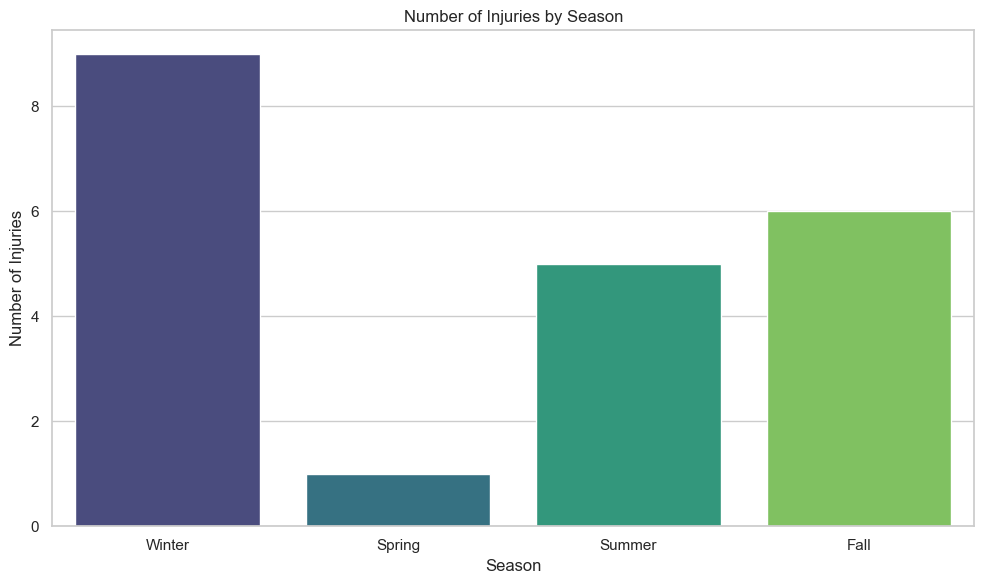

# Injury History Dataset: Comprehensive Analysis Summary

### Overview
This comprehensive analysis of the injury history dataset provides key insights into the occurrence, severity, recurrence, and recovery times of injuries experienced by players. The following summary highlights key findings and recommendations based on the exploratory data analysis conducted across various aspects of the dataset.

### Key Findings and Insights

1. **Injury Type Frequency and Body Parts Affected**
   - The most common injury types were **Tendonitis** (4 instances) and  **Muscle Strain** **Sprain** **Fracture** **Concussion** (3 instances), indicating a need for targeted prevention efforts for these specific types.
   - Injuries frequently affected **Knee** (5 instances), **Head** (3 instances). Strengthening exercises should focus specifically on these areas to minimize the injury risk, as they are disproportionately affected.

   
   

2. **Recovery Time Analysis**
   - **Recovery times** varied significantly, ranging from **5 to 150 days**, with most injuries recovering within **20 to 40 days** (3 instances). The longest recovery time was associated with an injury lasting **150 days**.
   - **Grade 2 injuries** had an average recovery time of **40.8 days**, which was notably longer compared to **Grade 1** injuries that averaged **15.3 days**. This suggests a need for more extensive rehabilitation protocols for severe injuries.

   
   

3. **Severity and Group Analysis**
   - **Group ID 215** had the highest number of **Grade 2** injuries (1 instance), and also experienced **Grade 1** and **Grade 3** injuries (1 instance each).
   - The average recovery time for **Group ID 215** was **71.7 days**, which was notably higher compared to other groups, indicating the need for more tailored recovery programs.

   
   

4. **Seasonal Injury Trends**
   - Injuries were most common during **Winter** (8 instances), followed by **Fall** (6 instances), and **Summer** (5 instances). The fewest injuries occurred during **Spring** (1 instance). This indicates that **Winter** is a particularly high-risk season, potentially due to factors such as colder weather affecting player conditioning and performance.
   - Preemptive measures, such as adjusting training loads and incorporating injury prevention exercises, should be prioritized during the Winter season to reduce injury occurrences.

   

5. **Player Injury Profiles and Recurrence**

   | Player ID | Injury Type | Count | Average Recovery Time (days) |
   |-----------|-------------|-------|-----------------------------|
   | 101       | Tendonitis  | 2     | 11.5                        |
   | 115       | Sprain      | 2     | 102.5                       |

   - **Player ID 101** experienced **Tendonitis** twice, with an average recovery time of **11.5 days**, suggesting possible insufficient recovery or underlying vulnerability.
   - **Player ID 115** experienced **Sprain** twice, with an average recovery time of **102.5 days**, indicating a severe recurring injury that requires specialized attention and longer rehabilitation to prevent further recurrence.
   - Detailed injury profiles were created for individual players, including the types of injuries experienced, affected body parts, and average recovery times. Personalized rehabilitation is crucial for players like **Player ID 115** to ensure complete recovery.

6. **Body Side Analysis**
   - Injuries were slightly more frequent on the **left side** (9 instances) compared to the right (7 instances), while **11 injuries** did not specify the side. This suggests a potential balance which might not be significant.

   

7. **Recovery Time by Body Part**
   - **Ankle** injuries had the longest average recovery time of **105 days**, followed by **Knee** injuries with an average of **70 days** and **Foot** injuries with an average of **60 days**.
   - **Groin** (average recovery time of **20 days**) and **Hamstring** (average recovery time of **15 days**) injuries exhibited relatively shorter recovery periods compared to other body parts.
   - Focused rehabilitation programs should be developed for body parts such as **Ankle, Knee, and Foot** to shorten recovery times and enhance player readiness.

   

8. **Hamstring to Quad Ratio**:
   - **Mean**: 0.71 (within ideal range), **Range**: 0.4 to 1.2.
   - **Deviations**: Values below 0.6 indicate hamstring weakness; values above 0.8 suggest quad underuse.

   

9. **Quad Imbalance Percent**:
   - **Mean**: 2.51% (within ideal range), **Range**: -11.5% to 15.2%.
   - **Deviations**: Values below -5% indicate weaker left quad; above 5% indicates stronger right quad.

   

10. **Hamstring Imbalance Percent**:
   - **Mean**: 0.98% (within ideal range), **Range**: -11.2% to 13.0%.
   - **Deviations**: Values below -5% indicate weaker left hamstring; above 5% indicates stronger right hamstring.

   

11. **Calf Imbalance Percent**:
   - **Mean**: 2.42% (within ideal range), **Range**: -11.7% to 14.9%.
   - **Deviations**: Values below -5% indicate weaker left calf; above 5% indicates stronger right calf.

   

12. **Groin Imbalance Percent**:
   - **Mean**: 2.44% (within ideal range), **Range**: -11.7% to 15.0%.
   - **Deviations**: Values below -5% indicate weaker left groin; above 5% indicates stronger right groin.

   

13. **Mean distance covered in miles**: 3.51

   

14. **Mean Exertion**: 297.30

   
   

15. **Mean Training Impulse**: 197.85

   

16. **Mean of Max Jump height in feet**: 2.55

   

17. **Mean heartratebpm**: 119.72

## Recommendations
- **Balance Training**: Focus on strengthening weak muscles identified outside the ideal range.
- **Injury Prevention**: Address asymmetries in hamstring-to-quad and side-to-side muscle balances to reduce injury risk.
- **Performance Improvement**: Achieving balance within the ideal range can enhance stability and performance.
- **Prevention Programs**: Focus on **strengthening exercises** for the **Quadriceps, Wrist, and Groin**, as these body parts are most frequently injured and have longer recovery times.
- **Seasonal Adjustments**: Implement **seasonal training modifications** during Spring and Fall, as these seasons see the highest number of injuries. Adjust training loads and include specific injury prevention exercises during these times.
- **Targeted Interventions for Recurrence**: Develop **specialized rehabilitation** for players prone to recurring injuries, such as **Player ID 101 (Tendonitis)** and **Player ID 115 (Sprain)**, to ensure complete recovery and reduce future risks.
- **Group-Specific Recovery Strategies**: Review **Group ID-specific training and rehabilitation** practices, especially for **Group ID 2**, which had the highest number of severe injuries, and **Group ID 3**, which had longer average recovery times. Adjust training methodologies to improve conditioning and reduce injury severity.
- **Side-Specific Training**: Implement **balanced strength training** to address asymmetries between the left and right sides of the body, reducing the likelihood of side-dominant injuries, particularly focusing on the **right side**, which had a slightly higher injury count.
- **Detailed Data Collection**: Improve **data collection** by ensuring that injury attributes like side (Left/Right) are consistently recorded, enabling more detailed analysis and insights for future injury prevention strategies.

### Conclusion
This analysis provides a detailed understanding of injury patterns, severity, recurrence, and recovery times for players in the dataset. By focusing on the data-driven recommendations above, it is possible to reduce injury occurrences, improve recovery outcomes, and ultimately enhance player safety and performance.

